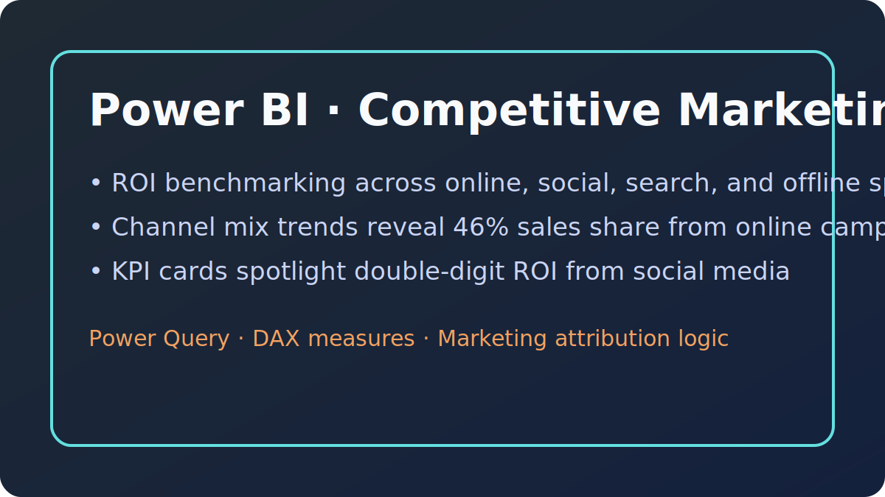

# 📈 Power BI Projects

Each dashboard blends solid data modeling with narrative-driven visuals. Download the PBIX to explore measures, or view PDF exports for a quick walkthrough.

## 1. Competitive Marketing Analysis

- **Objective:** Benchmark multi-channel marketing performance and ROI to reallocate spend toward the highest-yield tactics.
- **Dataset:** Aggregated campaign data (impressions, spend, conversions) across online, social, search, and offline channels.
- **Methodology:**
  - Built a star schema in Power Query separating campaign facts from dimension tables (channels, regions, time).
  - Authored DAX measures for ROI, conversion efficiency, and MoM trend deltas.
  - Used bookmarks and drill-through pages to highlight channel-specific KPIs for executive reviews.
- **Business Impact:** Reveals that Social Media delivers the strongest ROI (~12%) and supports shifting budget away from low-performing offline tactics.
- **Files:** `competitive-marketing-analysis.pbix`, `competitive-marketing-analysis.pdf`

---

## 2. Revenue Opportunities Dashboard

- **Objective:** Size pipeline value by region, partner tier, and sales stage to focus account teams on high-potential opportunities.
- **Dataset:** CRM export covering deals, partner classifications, territory, stage, and projected revenue.
- **Methodology:**
  - Modeled opportunity stages with calculated columns to normalize inconsistent naming from the CRM.
  - Authored DAX measures to compute weighted pipeline, stage velocity, and partner contribution.
  - Designed matrix and decomposition tree visuals to surface whitespace by geography and partner tier.
- **Business Impact:** Highlights $483.6M in open pipeline with concentration in West/Central regions, guiding resource allocation and partner enablement efforts.
- **Files:** `revenue-opportunities.pbix`, `revenue-opportunities.pdf`

---

## 3. Exchange and Portfolio Dashboard

- **Objective:** Monitor market activity across NASDAQ/NYSE/AMEX while assessing internal portfolio allocation.
- **Dataset:** Daily exchange volume feeds joined with portfolio holdings (ticker, weight, sector, gain/loss).
- **Methodology:**
  - Used Power Query to combine CSV feeds and enforce consistent data types.
  - Implemented DAX time-intelligence measures for rolling averages and day-range comparisons.
  - Leveraged bookmarks to toggle between market overview and portfolio drilldowns.
- **Business Impact:** Keeps the investment team informed on liquidity shifts and concentration risk—portfolio view shows $5.24M holdings led by UNH, GS, HD, and MSFT.
- **Files:** `exchange-portfolio-dashboard.pbix`, `exchange-portfolio-dashboard.pdf`

---

### 🔁 How to Reuse
1. Open the PBIX files in Power BI Desktop (June 2022+ recommended).
2. Refresh data connections with your own sources—fact/dimension schemas are documented in the Model view.
3. Review the `Measures` table for reusable DAX calculations (ROI, weighted pipeline, liquidity trends).
4. Export updated PDFs to share executive summaries without exposing the raw model.
