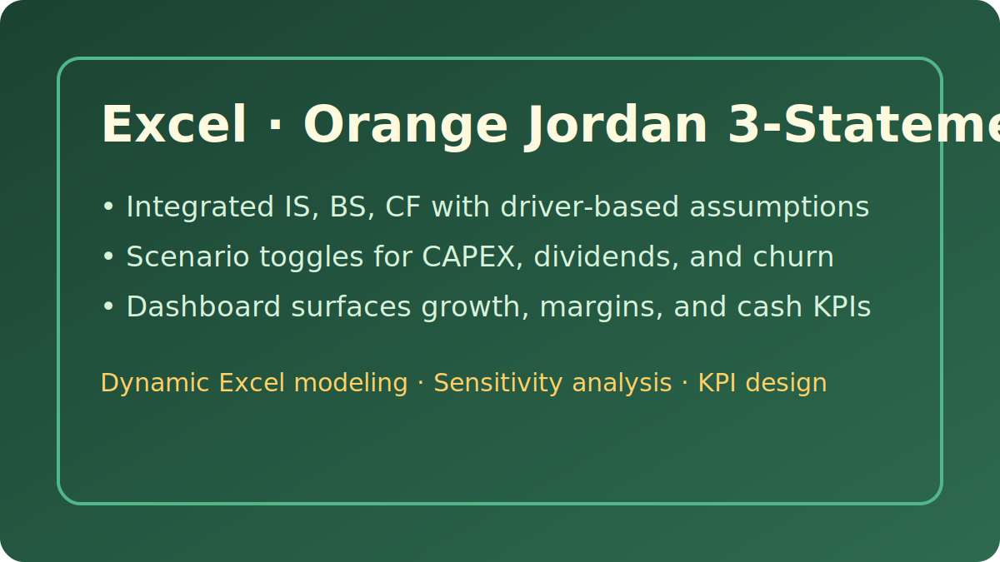
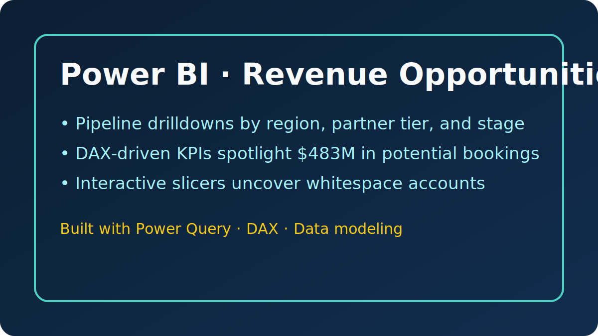
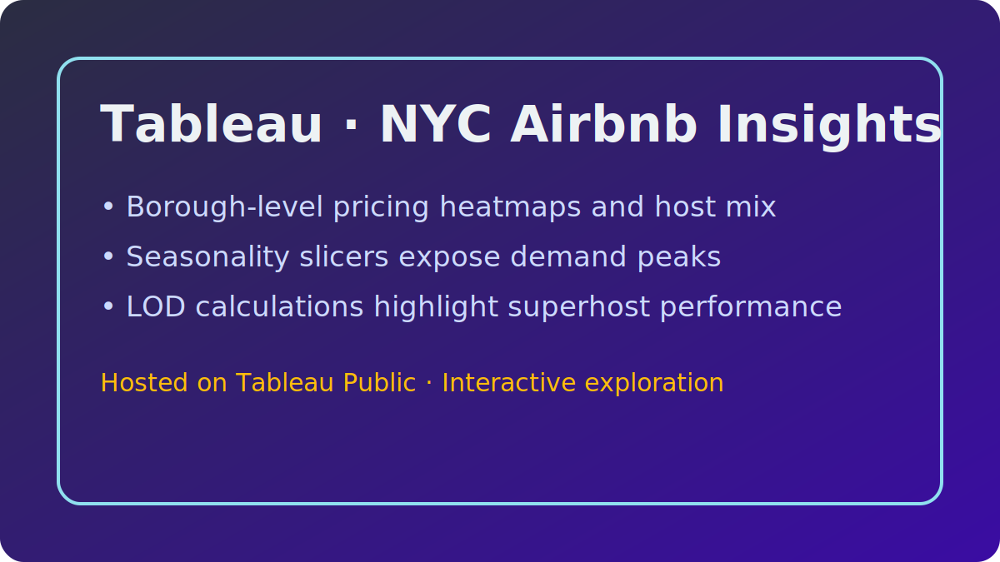

# Finance Analytics Portfolio

Welcome! I’m **Abdalmalik Sabri**, a finance student and aspiring financial analyst who translates raw data into business-ready insights. This portfolio curates my favorite Excel models, Power BI dashboards, Tableau stories, and SQL analyses that demonstrate how I evaluate performance, size opportunities, and guide strategic decisions.

  
  
  

## 🧭 Table of Contents
- [Featured Highlights](#-featured-highlights)
- [Excel Models](#-excel-models)
- [Power-BI Dashboards](#-power-bi-dashboards)
- [Tableau Stories](#-tableau-stories)
- [SQL Analytics](#-sql-analytics)
- [About Me](#-about-me)
- [How to Explore & Reuse](#-how-to-explore--reuse)

## 🌟 Featured Highlights
<table>
  <tr>
    <td width="50%">
      
      
<strong>Orange Jordan 3-Statement Model</strong> Scenario-ready model tying P&amp;L, balance sheet, and cash flow together to stress-test dividend and CAPEX policies.

    </td>
    <td width="50%">
      
      
<strong>Revenue Opportunities Dashboard</strong> Interactive pipeline diagnostics that spotlight $483M in whitespace and partner mix opportunities.

    </td>
  </tr>
</table>

## 📊 Excel Models
- <strong><a href="Excel_Projects/orange-jordan-model.md">Orange Jordan 3-Statement Model</a></strong> — Driver-based forecasting with WACC valuation scenarios and dashboard KPIs.
- <strong><a href="Excel_Projects/jpmc-analysis.md">Jordan Phosphate Mines (JPMC) Financial Review</a></strong> — Ratio analysis and capital-cost benchmarking across 2022–2023.

Assets live in the <code>Excel_Projects/</code> folder as cleanly named workbooks, PDFs, and documentation for easy download.

## 📈 Power-BI Dashboards
Dive into published PBIX files, PDFs, and methodology notes inside <code>PowerBI_Projects/</code>:
- <strong><a href="PowerBI_Projects/README.md#1-competitive-marketing-analysis">Competitive Marketing Analysis</a></strong> — Channel ROI benchmarking with spend efficiency callouts.
- <strong><a href="PowerBI_Projects/README.md#2-revenue-opportunities-dashboard">Revenue Opportunities</a></strong> — Pipeline opportunity sizing by partner tier, stage, and geography.
- <strong><a href="PowerBI_Projects/README.md#3-exchange-and-portfolio-dashboard">Exchange &amp; Portfolio Dashboard</a></strong> — Equity market coverage paired with portfolio exposure summaries.

## 📈 Tableau Stories
My Tableau Public dashboards (with methodology and links) are documented in <a href="Tableau_Projects/README.md">Tableau_Projects/README.md</a>. Highlights include:
- Calwest E-commerce performance overview
- NYC Airbnb market analysis with geographic segmentation
- Sales KPI story tracking profitability over time

## 🧠 SQL Analytics
The <a href="SQL_Projects.md">SQL project</a> walks through a reusable query suite for sales performance monitoring, including ranked region revenue, product profitability, CLV, and churn detection logic. Step-by-step instructions are included to recreate the schema and rerun the analysis locally.

## 👩‍💼 About Me
- 🎓 Finance Student @ University of Jordan
- 📜 Certifications: FMVA®, CFM®, BIDA®
- 💡 Focus Areas: Corporate finance, FP&amp;A analytics, revenue intelligence, market research
- 🛠️ Toolkit: Excel, Power BI, Tableau, SQL, Power Query, DAX, Python (pandas)

I’m passionate about blending finance fundamentals with modern analytics to answer the questions executives and investors care about most.

## 🚀 How to Explore & Reuse
1. **Browse documentation first** to understand objectives, methodology, and business impact.
2. **Download source files** (`.xlsx`, `.pbix`, `.pdf`) from each project folder for deeper inspection.
3. **Reuse components** like SQL snippets, DAX measures, or model templates in your own environment—attribution appreciated!
4. **Let’s connect** if you’d like a walkthrough or need help tailoring a dashboard/model to your use case.

> 💬 Have feedback or a collaboration idea? Reach out on <a href="https://www.linkedin.com/in/abdalmalik-sabri-fmva-cfm-23a656254" target="_blank">LinkedIn</a> or <a href="mailto:aboodsabri2004@gmail.com">email</a> me directly.

---

Need a refresher on publishing updates? Follow the step-by-step checklist in the [Portfolio Maintenance Guide](MAINTENANCE.md) to pull, commit, and push changes so they appear on GitHub.
