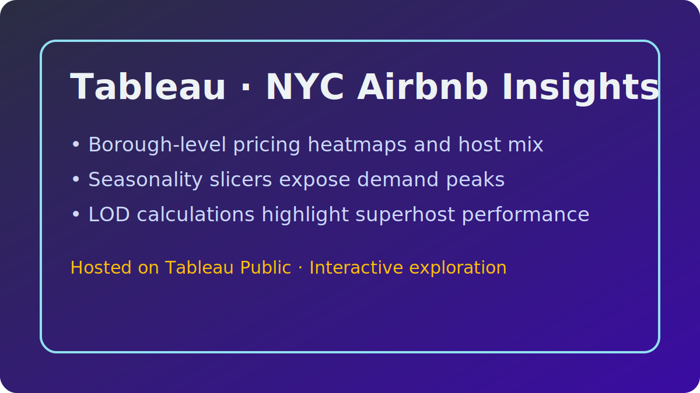

# 📊 Tableau Dashboards

These Tableau Public projects focus on interactive storytelling, blending spatial analysis with executive-ready KPIs. Each link opens the live dashboard; notes below summarize methodology and insights.

## 1. [Calwest E-commerce Overview](https://public.tableau.com/views/CalwestOverview/EcommerceOverview?:language=en-US&:display_count=n&:origin=viz_share_link)
- **Objective:** Provide leadership with a single view of e-commerce performance across categories and fulfillment regions.
- **Dataset:** Order-level transaction data (sales, profit, shipping) enriched with category and region dimensions.
- **Methodology:** Leveraged level-of-detail (LOD) expressions to compute category profitability and customer lifetime value, layered on map + bar visuals with parameter-driven date filters.
- **Highlights:** Rapidly identifies high-margin categories, underperforming regions, and seasonal spikes.

---

## 2. [NY Airbnb Market Analysis](https://public.tableau.com/views/NYAirbnb_17607335008210/NYAirbnb?:language=en-US&:display_count=n&:origin=viz_share_link)
- **Objective:** Explore supply, pricing, and occupancy dynamics across New York City boroughs.
- **Dataset:** NYC Airbnb public dataset (listings, price, reviews, availability, room type).
- **Methodology:** Combined geographic heatmaps with parameter controls to filter by room type and price band; LOD calcs identify top hosts and superhost penetration.
- **Highlights:** Surfaces borough price differentials, stays-per-month trends, and neighborhoods with rising demand.

---

## 3. [Sales Performance Dashboard](https://public.tableau.com/views/SalesPreformance_17607278003440/SalesDashboard?:language=en-US&:display_count=n&:origin=viz_share_link)
- **Objective:** Track revenue, profit, and discounting behavior across time and geography.
- **Dataset:** Sales transactions segmented by product, region, and customer segment.
- **Methodology:** Built dual-axis charts with quick table calculations to monitor YoY growth, while actions and tooltips provide context for each segment.
- **Highlights:** Identifies profitable product/region intersections and discount rates that erode margin.

---

### 🔁 How to Reuse
1. Follow the Tableau Public links above to interact with each dashboard.
2. Download the workbook (where available) via the Tableau Public interface to inspect calculations.
3. Adapt LOD and parameter examples for your own geographic or time-series analyses.

